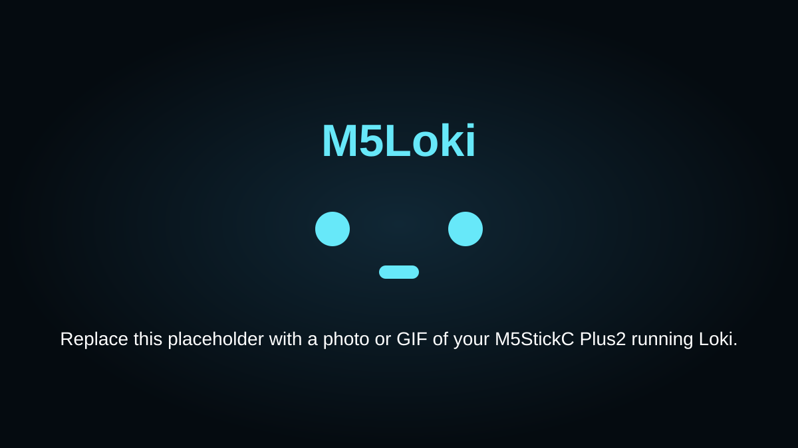
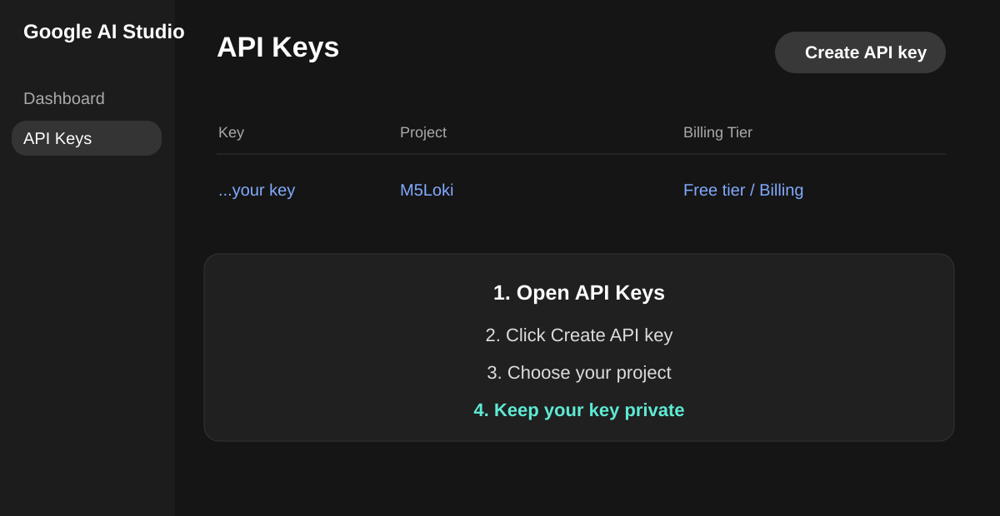
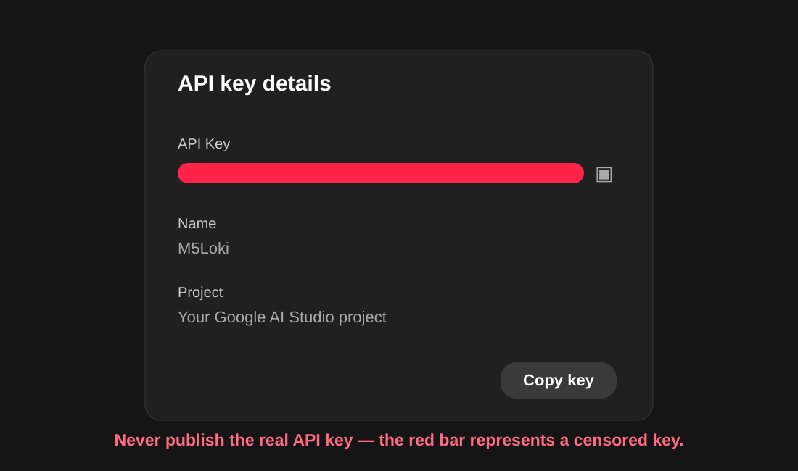

# M5Loki

**Open-source AI pet firmware for M5StickC Plus2.**

M5Loki turns an M5StickC Plus2 into a small voice-driven AI pet with English/Arabic conversations, expressive reactions, on-device Wi-Fi setup, appearance settings, time/battery status, and playful special actions.

<p align="center">
  
</p>

## Features

- Voice recording from the M5StickC Plus2 microphone
- Gemini-powered speech understanding and short pet-style replies
- Automatic English / Arabic language detection
- Arabic shaping + RTL rendering
- Matched 16 px English and Arabic reply fonts
- Reactive faces: neutral, happy, love, surprised, sad, angry, sleep, dead
- Recording waveform + fixed message/typing indicator
- Birthday cake + buzzer melody
- Press M5 during birthday music to stop immediately and return to Happy face
- On-device Wi-Fi scanner and password keyboard
- Appearance menu with Color, Theme, and Brightness
- Dynamic Dark/Light mode including the top status bar
- Time + sharp 4-block battery indicator
- Settings stored using ESP32 Preferences/NVS

## Hardware

- **M5StickC Plus2**
- USB-C cable
- 2.4 GHz Wi-Fi
- Your own Gemini API key

## Arduino setup

Install Arduino IDE 2.x and the required libraries:

- M5StickCPlus2
- M5Unified
- M5GFX
- ArduinoJson

Open:

```text
M5Loki/M5Loki.ino
```

Choose your M5StickC Plus2 / ESP32 board and COM port, then Verify and Upload.

> M5Loki contains embedded English and Arabic bitmap fonts, so compilation may take longer than a small Arduino sketch.

## Gemini API key — every user must use their own key

M5Loki does **not** include a working API key. Each user must create and paste their own key before uploading the firmware.

### 1. Create your key

Go to Google AI Studio:

https://aistudio.google.com/

Then:

1. Sign in.
2. Open **API Keys**.
3. Click **Create API key**.
4. Select or create a Google Cloud project.
5. Open the new key.
6. Click **Copy key**.
7. Keep the key private.

Official Google guide:

https://ai.google.dev/gemini-api/docs/api-key

<p align="center">
  
</p>

<p align="center">
  
</p>

> Never publish a real API key. The example/screenshot is intentionally censored.

### 2. Paste your key directly in M5Loki.ino

Near the top of `M5Loki.ino`, find:

```cpp
// ===================== USER CONFIG ======================
#define GEMINI_API_KEY "PASTE_YOUR_GEMINI_API_KEY_HERE"
```

Replace only the text between the quotation marks:

```cpp
#define GEMINI_API_KEY "YOUR_COMPLETE_GEMINI_API_KEY"
```

Keep the quotation marks. Do not add spaces inside the key.

This keeps setup simple: **no separate secret/config file is required to compile M5Loki.**

If you fork or publish your modified firmware, remove your real key first and restore the placeholder.

## Gemini model

The firmware uses the tested lightweight default:

```cpp
const char* GEMINI_MODEL = "gemini-flash-lite-latest";
```

Flash-Lite is a good match for M5Loki because the goal is fast, short pet-style voice interactions rather than long reasoning responses.

Before changing the model, check Google's current model documentation because aliases, quotas, and model availability can change:

https://ai.google.dev/gemini-api/docs/models

## Controls

| Action | Control |
|---|---|
| Talk | Hold **M5** |
| Send recording | Release **M5** |
| Show conversation reaction | Click **M5** |
| Stop birthday song | Press **M5** while music is playing |
| Open menu | Top side button |
| Navigate | Top / bottom side buttons |
| Select | M5 |

## Interaction flow

```text
Hold M5
  ↓
Recording face
  ↓
Release
  ↓
Message/typing indicator
  ↓
Loki reply
  ↓
Click M5
  ↓
Conversation reaction
```

Birthday example:

```text
"It's my birthday"
"Play birthday music"
"اليوم عيد ميلادي"
        ↓
Cake + birthday melody
        ↓
Press M5 anytime
        ↓
Music stops + Happy face
```

## Menu

```text
Wi-Fi
Time
Appearance
About
Back
```

Inside **Appearance**:

```text
Color
Theme
Brightness
Back
```

Available accent colors:

- Cyan
- Green
- Magenta
- Yellow
- Orange

Dark/Light mode changes the full interface, including the status bar.

## Wi-Fi

Wi-Fi setup is completely on-device:

1. Open Menu → Wi-Fi.
2. Select your network.
3. Enter the password using the on-device keyboard.
4. Select **CONNECT**.

Saved Wi-Fi credentials are stored in ESP32 Preferences/NVS.

## Language support

M5Loki automatically follows the spoken language:

```text
English speech → English reply
Arabic speech  → Arabic reply
```

Arabic rendering includes contextual shaping and RTL display. Western digits `0-9` are used in both languages.

## HTTP 429 / RESOURCE_EXHAUSTED

If Gemini returns:

```text
429 RESOURCE_EXHAUSTED
```

check your Google AI Studio **Usage**, **Rate Limit**, and billing/free-tier quota. This is generally an API quota/rate-limit issue rather than an M5StickC Plus2 microphone failure.

## Repository structure

```text
M5Loki/
├── M5Loki/
│   ├── M5Loki.ino
│   ├── config.h
│   ├── M5Loki_prototypes.h
│   ├── M5Loki_globals_*.inc
│   └── M5Loki_impl_*.inc
├── docs/
│   └── images/
├── CONTRIBUTING.md
├── LICENSE
├── README.md
└── SECURITY.md
```

`config.h` is only a compatibility header for the modular Arduino source. **The user API key is entered directly in `M5Loki.ino`.**

## Security note

An API key compiled into microcontroller firmware should be treated as a device credential, not as a perfectly secret server-side credential. This setup is appropriate for personal/open-source experimentation. For a commercial product, use a backend/proxy architecture so reusable cloud credentials are not distributed in firmware.

## License

M5Loki is open source under the **MIT License**. See [LICENSE](LICENSE).

## Author

**Fahad AlAjmi**

- GitHub: [@faajmid](https://github.com/faajmid)
- Instagram: [@faajmid](https://instagram.com/faajmid)
- TikTok: [@faajmid](https://www.tiktok.com/@faajmid)
- Email: [faajmid@gmail.com](mailto:faajmid@gmail.com)
